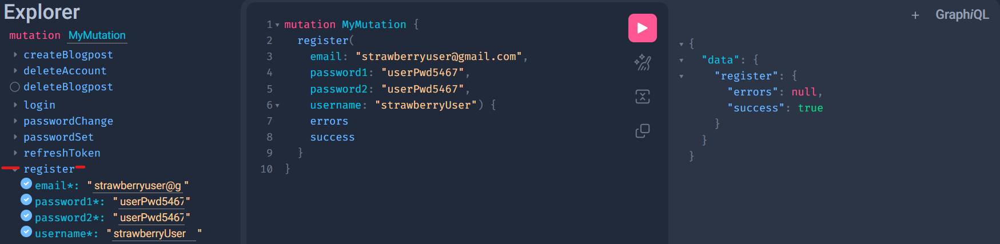

# ```grbloggr```

<p float="left">
  
  
</p>


##
Built with Django and Strawberry GraphQL, ```grbloggr``` is a GraphQL API that serves as the backend server for a simple blog platform. It allows users to 
* Register and login to the API
* Create blog posts
* Get a list of blog posts from the database
* View the details of each post
* Update existing blog posts
* Delete existing blog posts

### 1. Project structure
The project structure follows a typical Django setup:

#### ``` users/ ```
User management - creation, authentication, update and deletion of user accounts 

#### ``` blog/ ``` 
Content management - creation, listing, update and deletion of blogs by authorised users  

#### ```grbloggr/```
Main project directory

#### ```manage.py``` 
Django's command-line utility for administrative tasks.


### 2. Features
```Authentication:``` Users can register to create new accounts, login, update their accounts and logout.<br/>
```Content Creation:``` Users can create new blog posts with titles, content, and author information. Users can update and delete their blog posts as well!


### 3. GraphQL API Queries & Mutations: 
The API is implemented using the Strawberry framework, providing a GraphQL endpoint for interacting with user and blog data.

#### ``` users```

#### queries
* me
* public

#### mutations
* register
* login
* verifyAccount
* verifyToken
* refreshToken
* passwordSet
* passwordChange
* updateAccount
* deleteAccount


#### ``` blog```

#### queries
* getBlogosts
* getBlogPostsByLimit

#### mutations
* createBlogPost
* updateBlogPost
* deleteBlogPost


## 4. Installation

* Get a copy of the source code of this project into your local repository.

```
git clone https://github.com/KelvinJC/grbloggr.git
```

* The code will be packaged in a directory named grbloggr so change into that directory

```
cd grbloggr
```

* To begin using the application, initiate the server by running the following command to build and run the containers in one go

```
docker compose up --build 
```

### 5. Usage
#### Running the server:
By default, Django apps listen on port 8000 so once the server is running, 
copy and paste ```http://127.0.0.1:8000/api``` into your preferred browser.<br>

To prevent clashes on port 8000, make sure no other Django app is running on localhost.


### 6. Documentation
```grbloggr``` relies on the auto-generated GraphQL documentation which can be accessed at

```http://127.0.0.1:8000/graphql``` 

You can view the full documentation of the API and perform queries and mutations just as you would on Postman or any other API client.


### Authentication and Authorisation.

JWT authentication ensures that users are properly authenticated. 
This serves to ensure that only authors can update or delete their posts

### Database choice
This project makes use of a Postgres database which is within a separate docker container 
for persistent storage of blog posts as well as user information. 

If you require a different database, customisation is possible via the settings.py file. <br><br>


### Django Admin User
This step is not critical to the usage of the app but if you are familiar with the Django Admin UI you can make use of it. 

To access the Django Admin UI visit ```http://127.0.0.1:8000/admin```


### System design
The system consists of an NGINX web server to handle HTTP requests from a client browser. It in turn forwards these requests to the Django application server through an intermediary Gunicorn web server gateway interface.
The persistence layer is a Postgres database. This handles data query requests from the application server.

The gateway interface and application server reside within the same Docker container while the database and web server rest in separate Docker containers. Since all services share a single Docker Compose configuration file, they share the same network within a host OS.


#### POSSIBLE ERROR ON WINDOWS OS: Container exits right after build 
This can be fixed by taking the following steps:
1. Open the project in VSCode, navigate to the shell script at this path

``` grbloggr/infrastructure/grbloggr/server-entry.sh ```

2. If the file ending indicator on the bottom right displays CRLF, click on it and switch to LF. (Look at the screenshot below.)

3. Then rerun the docker compose up --build command at the project's root directory.
(It is a file ending error associated with pushing shell scripts to a git repo from a Windows OS)


